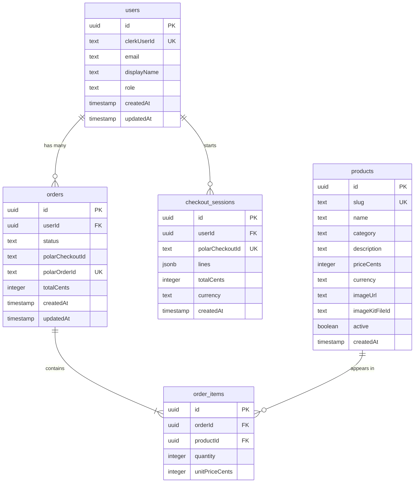

# 🛒 SwiftMart

SwiftMart is a modern, high-performance, full-stack e-commerce web application. It features a responsive React-based client interface, a TypeScript-powered Express backend, a PostgreSQL database managed via Drizzle ORM, Clerk authentication, Polar.sh billing, ImageKit asset hosting, GetStream chat & video calls, and Sentry monitoring.

**🌐 Live Demo:** [https://swiftmart-leeb.onrender.com](https://swiftmart-leeb.onrender.com)

---

## 🛠️ Tech Stack & Architecture

SwiftMart is structured as a monorepo consisting of two primary components:

*   **Frontend (`/frontend`)**: Built with React (using Vite), styled with Tailwind CSS & DaisyUI, and optimized with TanStack React Query for caching, Zustand for local state persistence, and React Router for nested views.
*   **Backend (`/backend`)**: Built with Express.js, TypeScript, and Drizzle ORM to interface with a PostgreSQL database.

| Service | Technology Used | Purpose |
| :--- | :--- | :--- |
| **Frontend Framework** | React (Vite) | Client-side application framework |
| **Styling** | Tailwind CSS & DaisyUI | Utility-first styling & themed UI components |
| **State Management** | Zustand | Persists user cart to `localStorage` |
| **API Queries** | TanStack React Query | Client-side caching and mutation handling |
| **Routing** | React Router | UI routing and nested route management |
| **Backend Framework** | Express.js & TypeScript | Server API, routing, and middlewares |
| **Database & ORM** | PostgreSQL & Drizzle ORM | Database storage and schema relations management |
| **Authentication** | Clerk Auth | User sign-in/sign-up, JWT validation, and user profile sync |
| **Payment Gateway** | Polar.sh | Fixed-price checkout page & webhooks for paid orders |
| **Real-time Chat** | Stream Chat SDK | Customer-support chat rooms for paid orders |
| **Video Calling** | Stream Video SDK | Direct support video calling inside chat channels |
| **Asset Storage** | ImageKit | Cloud image upload and deletes for product images |
| **Observability** | Sentry | Error tracking, logs breadcrumbs, and performance traces |

---

## 📂 Project Directory Structure

```
SwiftMart/
├── backend/
│   ├── src/
│   │   ├── controllers/      # Route logic & request handling
│   │   ├── db/               # PostgreSQL schema definition & Drizzle setup
│   │   ├── lib/              # Client wrappers (Clerk, Polar, Stream, ImageKit)
│   │   ├── middleware/       # Express route middlewares (Auth, Sentry)
│   │   ├── routes/           # REST API endpoints
│   │   ├── webhooks/         # Clerk & Polar webhook handlers
│   │   ├── index.ts          # Server entry point
│   │   └── instrument.ts     # Sentry backend instrumentation
│   ├── scripts/              # Seed scripts (seed.ts)
│   ├── package.json
│   └── tsconfig.json
├── frontend/
│   ├── src/
│   │   ├── components/       # Reusable UI elements (Navbar, Cards, Skeletons)
│   │   ├── hooks/            # Custom hooks for fetching and state synchronization
│   │   ├── lib/              # apiFetch wrapper for Clerk-signed requests
│   │   ├── pages/            # Client views (HomePage, Cart, Admin, Support, Demo)
│   │   ├── store/            # Zustand persistent store (cart.js)
│   │   ├── App.jsx           # Main React component & route configuration
│   │   └── main.jsx          # Client entry point
│   ├── package.json
│   └── vite.config.js
└── README.md                 # Project root documentation
```

---

## 🚀 Key Functionalities & Features

### 1. User Authentication & Profile Synchronization
*   **Clerk Auth Integration**: The application uses Clerk for authentication. Unauthenticated users can search/filter and add items to their cart. Authentication is required to view order history, start checkouts, join support chat, or launch video calls.
*   **Database Sync Webhook**: An Express endpoint (`/webhooks/clerk`) listens for Clerk webhook events (`user.created`, `user.updated`, and `user.deleted`). Upon trigger, it upserts the user profile (email, name, role) in the PostgreSQL `users` table or removes them on deletion.
*   **RBAC (Role-Based Access Control)**: Users are assigned roles (`customer`, `support`, `admin`) via Clerk's `public_metadata.role` attribute. Route access is verified against these roles.

### 2. Product Catalog & Shopping Cart
*   **Interactive Catalog**: Displays active products with sorting/filtering by categories. Uses search parameters for clean navigation.
*   **Persistent Cart (Zustand)**: Users can add products to a shopping cart, adjust quantities, or remove items. The cart persists across browser reloads via Zustand's `persist` middleware inside `localStorage`.

### 3. Payment Processing & Order Fulfillment
*   **Checkout Init**: Authenticated users can submit their cart to `/api/checkout`. The backend calculates prices in cents, verifies active products in the database, generates a local `checkoutSessions` record, and requests a checkout link from **Polar.sh**.
*   **Webhook Fulfillment**: When a payment succeeds, **Polar** triggers the `order.paid` event to `/webhooks/polar`. The backend processes this via a Drizzle transaction:
    1.  Fetches and locks the checkout session for updates (`FOR UPDATE` SQL row lock).
    2.  Creates a new `orders` entry with status `"paid"`.
    3.  Copies checkout items into `orderItems` and deletes the active session.

### 4. Support System (Real-time Messaging & Video Calls)
*   **Stream Chat Integration**: Once an order is paid, the customer can open the order support chat. The frontend connects to the Stream API using tokens generated at `/api/stream/token` and initializes a `messaging` channel named `order-<orderId>`.
*   **Video Call Invites**: Support agents and admins have a button to "Send video call invite". Doing so sends a custom payload message to the chat channel containing a `join_url`.
*   **Integrated Video Calls**: Clicking the "Join video call" link inside chat takes both the user and the support staff to a video chat room powered by Stream Video SDK. The page includes camera and microphone toggle controls.

### 5. Admin Dashboard (`/admin`)
*   **Product CRUD**: Admins can add, update, and manage the product listings. Input is validated on the backend using **Zod**.
*   **ImageKit Asset Upload**: Direct client-side uploads are facilitated by generating temporary cryptographic credentials via `/api/admin/imagekit-auth`.
*   **Safe Deletion Guard**: Before deleting a product, the backend checks if it exists in any orders (`orderItems`). If it has been purchased, deletion is blocked, and the admin is advised to deactivate it instead to maintain order history integrity. If clean, the product record and its ImageKit file are deleted.

### 6. Observability & Sentry Demo
*   **Sentry Monitoring**: Integrated on both frontend and backend to capture application performance metrics and exceptions.
*   **Sentry Demo Page (`/demo-sentrh`)**: An interactive sandbox loaded with triggers to simulate standard production exceptions:
    *   *Payment Declined*: Fires custom warnings, logging decline codes and Stripe metadata.
    *   *Insufficient Stock*: Demonstrates inventory reservation crashes.
    *   *Carrier API Timeout*: Captures external network fetch limits.
    *   *Tax Calculation Rejections*: Triggers validation errors for specific addresses.
    *   *Webhook Signature Failures*: Models invalid signatures or replay scenarios.
    *   *API Rate Limits*: Demonstrates warning logs.

---

## 💾 Database Schema

The PostgreSQL database uses the following table relations:



---

## ⚙️ Setup & Installation

### 1. Backend Configuration
Create a `.env` file in the `/backend` directory matching these environment variables:

```ini
PORT=3001
NODE_ENV=development
DATABASE_URL=postgresql://<username>:<password>@<host>:<port>/<dbname>
FRONTEND_URL=http://localhost:5173

# Clerk Authentication
CLERK_PUBLISHABLE_KEY=pk_test_...
CLERK_SECRET_KEY=sk_test_...
CLERK_WEBHOOK_SECRET=whsec_...

# Polar Billing
POLAR_ACCESS_TOKEN=polar_at_...
POLAR_WEBHOOK_SECRET=whsec_...
POLAR_CHECKOUT_PRODUCT_ID=... # Polar checkout product ID (UUID)
POLAR_API_BASE=https://api.polar.sh

# Stream Chat & Video (Note the typo STREM_* in backend code)
STREM_API_KEY=...
STREM_API_SECRET=...

# ImageKit Asset Uploads
IMAGEKIT_PUBLIC_KEY=...
IMAGEKIT_PRIVATE_KEY=...
IMAGEKIT_URL_ENDPOINT=https://ik.imagekit.io/...

# Observability
SENTRY_DSN=https://...
```

### 2. Frontend Configuration
Create a `.env` file in the `/frontend` directory:

```ini
VITE_CLERK_PUBLISHABLE_KEY=pk_test_...
VITE_API_URL=http://localhost:3001
VITE_SENTRY_DSN=https://...
```

### 3. Setup Commands

**Install Backend Dependencies & Setup Database**
```bash
cd backend
npm install

# Push the Drizzle schema to your Postgres database
npm run db:push

# Seed sample catalog products into the database
npm run db:seed
```

**Install Frontend Dependencies**
```bash
cd ../frontend
npm install
```

---

## 🏃 Running the Application

In development, both the frontend and backend servers can be run concurrently:

**Start Backend API Server** (runs on `http://localhost:3001` by default)
```bash
cd backend
npm run dev
```

**Start Frontend Dev Server** (runs on `http://localhost:5173` by default)
```bash
cd frontend
npm run dev
```

---

## 🔌 API Endpoints Reference

### Public Catalog APIs
*   `GET /api/products` - Returns list of active products (supports optional query `?category=Name`).
*   `GET /api/products/:slug` - Returns detail of single active product by slug.
*   `GET /api/products/categories` - Returns sorted list of all product categories.

### Authenticated User Profile
*   `GET /api/me` - Syncs Clerk context and returns matching local user profile.

### Checkout APIs
*   `POST /api/checkout` - Validates cart items, records a checkout session, and returns a checkout redirect URL from Polar.sh.

### Order Management & Stream Handlers
*   `GET /api/orders` - Lists orders (customers see only theirs; support/admins see all orders).
*   `GET /api/orders/:id` - Returns order items and details.
*   `POST /api/orders/:id/stream-channel` - Connects client and returns the Stream chat channel information.
*   `POST /api/stream/token` - Generates Stream JWT token for user chat and video connections.
*   `POST /api/orders/:id/video-invite` - *[Staff Only]* Dispatches a video call invite component into the chat window.

### Admin APIs
*   `GET /api/admin/products` - Lists all products regardless of active status.
*   `POST /api/admin/products` - Creates new product in catalog.
*   `PATCH /api/admin/products/:id` - Patches product parameters.
*   `DELETE /api/admin/products/:id` - Deletes product or blocks deletion with 409 if ordered.
*   `GET /api/admin/imagekit-auth` - Fetches cryptographic authentication signature for client-side uploads.

### Webhook Endpoints
*   `POST /webhooks/clerk` - Syncs users database table from Clerk user auth events.
*   `POST /webhooks/polar` - Verifies signatures and creates order entries for paid transactions.
